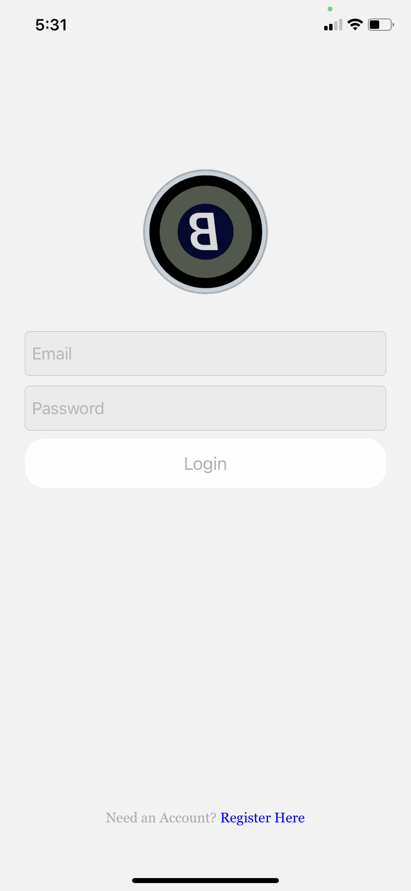
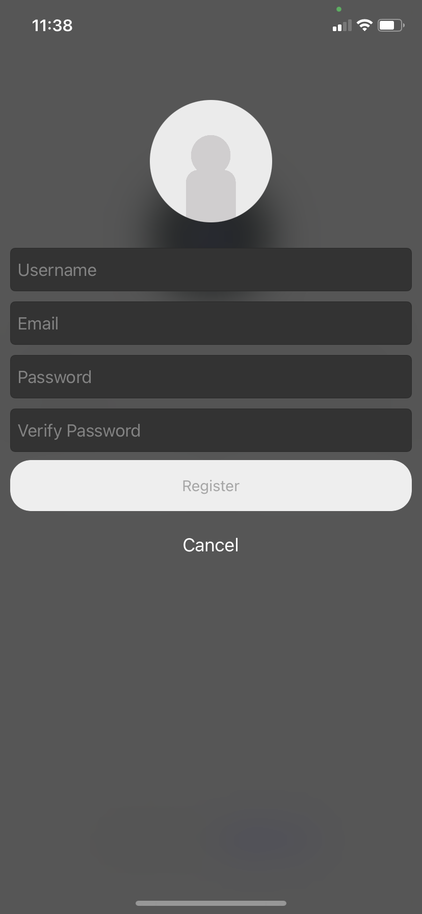
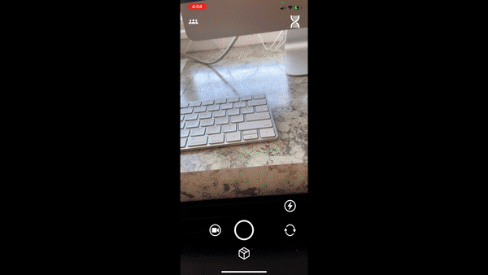
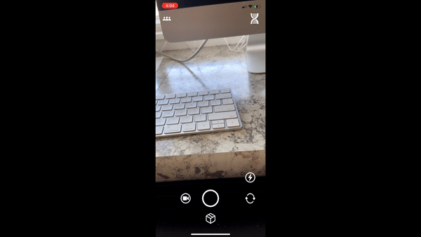
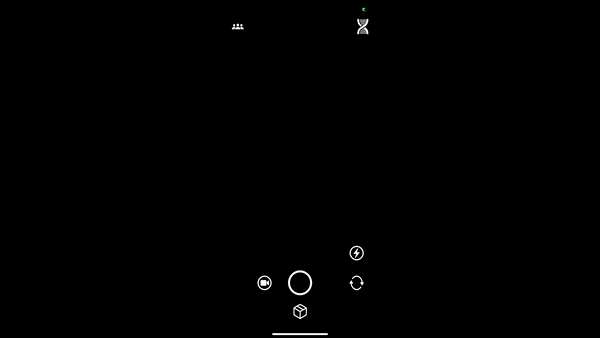

# Blink
---
## Purpose
Blink is a media sharing app which lets users record videos, take pictures, and send them to their friends directly. A key feature of Blink is the Gene Pool In which users can browse media content as well as submit their own. Each user has a score and the more likes a user recieves from either sending media content to the Gene Pool, or directly to a friend, his/her score will increase. Connections is another key feature which allows users to discover others by the detection of mutual likes in media content. For example, if User A likes the media content of User B and at some time later User B likes User A's content, a connection will populate in the connections view for both User A and User B. Both Users are given the option to friend one another, or erase the connection.

### Target Audience:
College Students

## Screen Shots: 

### Login/Register

  
  

### Gene Pool

### Send Media

### Side Bar Menu
 

## Features and Requirements Cecklist
### Feature - Media Capture
[X] - Audio Video Capture  
[X] - Camera Flip Functionality  
[] - Camera Flip While Recording  
[] - Ability to add text/drawing to media capture  
[X] - Focus/Zoom Feature  
[] - Add button icons  

### Feature - Swipe Navigation
[X] - Main Menu Right Swipe to show sidebar menu  
[] - Main Menu Pull in Gene Pool with Left Swipe  
[X] - Gene Pool Swipe Navigation between "chicks" and "dudes"  
[X] - Gene Pool Scroll feature to browse media content  
[] - Main Menu Up Swipe to view camera roll content  

### Feature - Gene Pool
[] - Ability to take media capture and send to Gene Pool  
[] - Take media capture and store the image in Firebase storage and a reference to the storage location in the Firebase Database  
[] - Ability for users to see media capture content in Gene Pool  
[] - When user views the Gene Pool, Retrieve images within a 100 mile radius.  
[] - Store images in Database with lat long coordinates  

### Feature - Connections
[] - Ability to detect when User A likes User B's Gene Pool Content and vice versa. Here a connection populates
[] - Ability to chat, friend, or discard connection

## Testing
[] - Simultaneous button presses  
